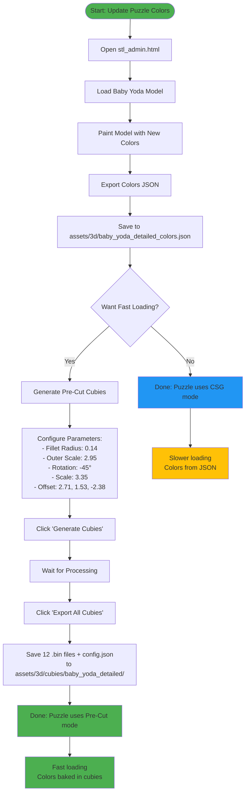
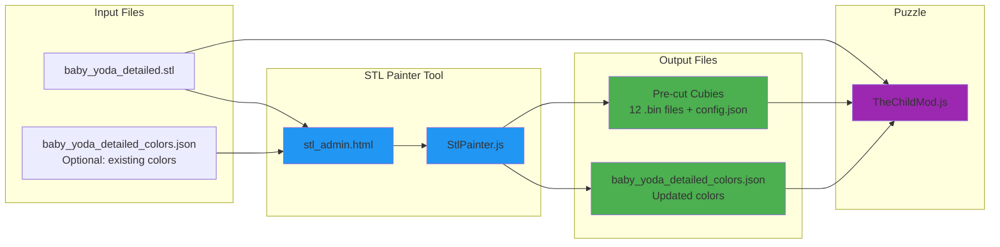
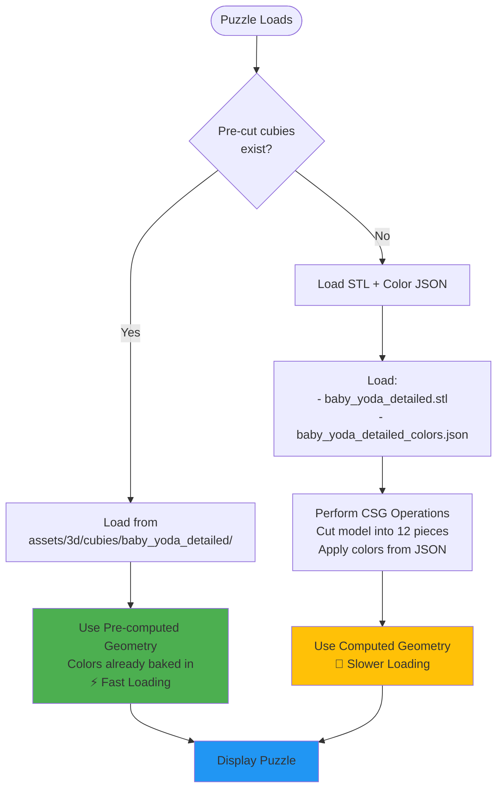

# Color Update Workflow Diagram

## File Flow Diagram

## Loading Priority in TheChildMod.js

## Color Update Scenarios

### Scenario 1: Update Colors Only (Not Recommended)

### Scenario 2: Update Colors + Re-Generate Cubies (Recommended)

## Quick Reference: What Files Do What?

| File | Purpose | When to Update |
|------|---------|----------------|
| `baby_yoda_detailed.stl` | 3D model geometry | Rarely (only if changing model) |
| `baby_yoda_detailed_colors.json` | Vertex colors | Every time you update colors |
| `cubies/*.bin` (12 files) | Pre-cut geometries with baked colors | Every time you update colors (for performance) |
| `cubies/config.json` | Cubie metadata | Every time you generate cubies |

## Performance Comparison

| Mode | Load Time | When to Use |
|------|-----------|-------------|
| **CSG Mode** (no cubies) | ~3-5 seconds | Testing color changes |
| **Pre-cut Mode** (with cubies) | ~0.1-0.3 seconds | Production use |

**Recommendation**: Use CSG mode while iterating on colors, then generate cubies for the final version.
